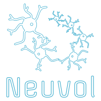

# Neuvol

*Genetic algorithm to find the best neural network architecture with Keras*

Neuvol is a genetic algorithm API for generating neural networks based on Keras. The main idea is to work with data only, without direct architecture constructing.

##### Grow your own neural network!

- Data in -> Neural Network Architecture out
- A large number of allowed layers types

### Features:

- Supported data types: texts, images
- CNN, Dense, LSTM, Max polling are available
- Dropout and reshape sub-layers (Flattern) are available too

### TODO

- [x] Architectures distribution generation
- [x] Images support
- [x] More available layers
- [x] Logo
- [ ] Serialiser
- [x] Complex layer generation
- [ ] Experimental study
- [ ] Visualization